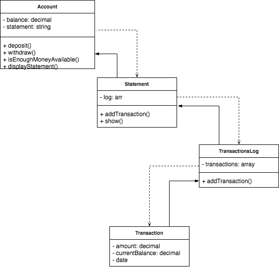

# Bank Tech Test
Week 10 - Tech tests

Summary
----

A small app that allows bank customers to deposit and withdraw money from their account, along with printing a transactions statement.

## Technologies used
- Back-end
  - JavaScript
- Testing
  - Jasmine
  - Karma
  - Istanbul (for test coverage)
- NPM

## Instructions to interact with the code

#### Prerequisites
- Node.js installed on computer

#### Running
User can interact with the code via the JavaScript Console
```sh
git clone https://github.com/antcin/bank-tech-test.git
cd bank-tech-test.git
open index.html
```

##### Example of commands
```javascript
let account = new Account() //creates a new account
account.deposit(5000) // makes a deposit of 5000
account.withdraw(2000) // makes a withdrawal of 2000
console.log(account.displayStatement()) // displays the statement
account.withdraw(500000) // would throw a 'not enough money error'
```

#### Testing

- Using Jasmine
  ```sh
  cd bank-tech-test
  open spec/SpecRunner.html
 ```
- Using Karma
  ```javascript
  npm test
  ```
##### Extract from `accountSpec.js` [testing Account#deposit]
```
describe('#deposit', function () {
  beforeEach(function () {
    spyOn(statement, 'addTransaction')
  })

  it('increases the bank balance', function () {
    account.deposit(100.00)
    expect(account.balance).toEqual(100.00)
  })

  it('adds deposit transaction to statement', function () {
    account.deposit(100.00)
    expect(account.statement.addTransaction).toHaveBeenCalled()
  })
})
```

## Approach
I decided to approach this task by applying several concepts learnt during the first ten weeks at Makers:

- [User stories](#user-stories): in order to have a better understanding of the task, I converted the _Acceptance criteria_ into user stories.
- [Domain modelling](#domain-modelling): I spent quite a bit of time drawing diagrams on paper, with the aim of having a relatively clear idea of how the different components of the program would interact.
- TDD: once I felt comfortable with my planning, I moved on to developing the app in a test-driven way, making sure that every component was fully tested before being implemented.
- SRP and Dependency injection: I tried my best to ensure that each class had a single responsibility and was independent from the other.
- DRY: where possible, I tried to avoid repetitions.

## Reflections

This has been a really great exercise. It has helped me to have a better understanding of JavaScript, from simple syntax to more complex concepts (i.e. IIFE, Modules).

Testing was probably the main challenge: I learnt a lot about the differences between Jasmine's standalone `SpecRunner` and the CLI tool. Whilst I didn't have any problem with the `SpecRunner`, and all my tests were passing; it was quite frustrating to run `jasmine` in the terminal and see the tests failing because of  `SpecHelper.js` file not being properly read/imported. Therefore, I decided to implement the test runner Karma to be able to run Jasmine tests from the CLI. Because of the size of this exercise, I haven't really managed to explore all the functionalities of Karma; from the little I saw, I can safely say that I will use it in future projects that.

With regards to the code, I am overall pleased with what I achieved, especially with the effort I put in using dependency injection. I am not really happy with the method `Statement#show`; I believe there are neater ways of implementing that (perhaps creating a `Date` class?).

I wasn't able to run the acceptance script in `node`. [`TypeError: Account is not a constructor`]. I will have to do more research on this topic.

## User stories

```sh
As a new bank customer,
So that I can manage my finances,
I would like to create an account.
```

```sh
As a bank customer,
So that I can keep money in my account,
I would like to be able to make a deposit into my account.
```

```sh
As a bank customer,
So that I can keep money in my account,
I would like to be able to withdraw money from my account.
```

```sh
As a bank customer,
So that I can keep track of my financial activities,
I would like to be able to print a bank statement.
```

## Domain modelling


**Requirements**
* You should be able to interact with the your code via a REPL like IRB or the JavaScript console
  * You don't need to implement a command line interface that takes input from STDIN
* Must have features for deposits and withdrawal
* Must have a feature to display account statement (date, amount, balance)
* Data can be kept in memory (it doesn't need to be stored to a database or anything)

**Acceptance criteria**
* Given a client makes a deposit of 1000 on 10-01-2012 And a deposit of 2000 on 13-01-2012 And a withdrawal of 500 on 14-01-2012 When she prints her bank statement Then she would see:

```
date       || credit  || debit  || balance
14/01/2012 ||         || 500.00 || 2500.00
13/01/2012 || 2000.00 ||        || 3000.00
10/01/2012 || 1000.00 ||        || 1000.00
```
